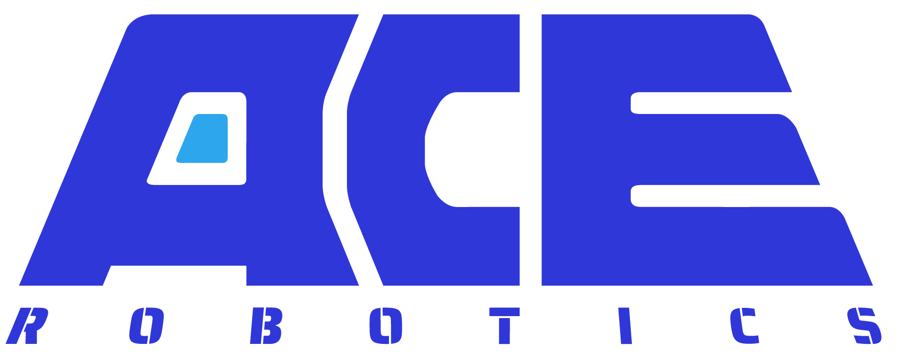
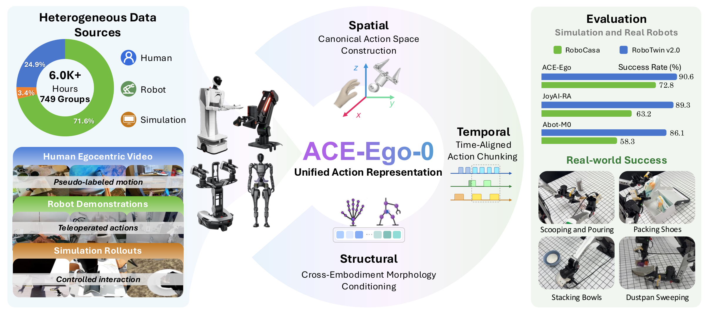
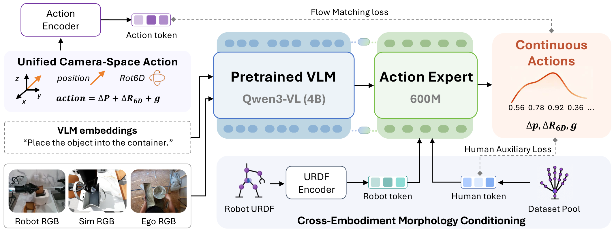

<p align="center">
  
  &nbsp;&nbsp;&nbsp;&nbsp;&nbsp;&nbsp;
  
</p>

<h1 align="center">ACE-Ego-0: Unifying Egocentric Human and Robotic Data for VLA Pretraining</h1>

<p align="center">
  <a href="https://github.com/ACERobotics-VLA/ACE-Ego-0"><strong>GitHub</strong></a> ·
  <a href="_CoRL2026_ACE_Ego_0.pdf"><strong>Paper</strong></a> ·
  <a href="#-overview"><strong>Overview</strong></a> ·
  <a href="#-repository-status"><strong>Code</strong></a> ·
  <a href="#-data-and-models"><strong>Data</strong></a> ·
  <a href="#-citation"><strong>Citation</strong></a>
</p>

<p align="center">
  
</p>

## 🔥 News

- **2026-06**: ACE-Ego-0 code repository is being prepared for public release.
- **2026-06**: Project materials for *ACE-Ego-0: Unifying Egocentric Human and Robotic Data for VLA Pretraining* are under active organization.

## 📖 Overview

**ACE-Ego-0** is a unified vision-language-action (VLA) pretraining framework that combines egocentric human videos, multi-embodiment robot demonstrations, and simulation rollouts for robot policy learning.

Large-scale egocentric human videos provide broad real-world interaction coverage, but they do not directly match robot action spaces, embodiments, temporal dynamics, or supervision quality. ACE-Ego-0 addresses these gaps with camera-space actions, morphology conditioning, time-aligned action chunking, and reliability-aware auxiliary supervision.

## ✨ Highlights

- **Human + robot pretraining**: Uses 4.53K hours of robot/simulation data and 1.48K hours of pseudo-action-labeled egocentric human data.
- **Camera-space action alignment**: Represents human pseudo-actions and robot end-effector trajectories in the observation-centric camera frame.
- **Morphology conditioning**: Conditions the action expert with robot URDF graph embeddings and learned human surrogate tokens.
- **Strong transfer**: Achieves 72.8% average success on RoboCasa GR1 TableTop, 91.12% / 90.62% on RoboTwin 2.0 Easy / Hard, and 78.3% average success on real bimanual ARX tasks.

## 🧠 Method

<p align="center">
  
</p>

ACE-Ego-0 resolves four core mismatches between egocentric human video and robot trajectories:

1. **Spatial mismatch**: Human and robot motions are normalized through camera-space action representations.
2. **Embodiment mismatch**: Robot morphology and human surrogate embodiment information condition the action model.
3. **Temporal mismatch**: Action chunking aligns heterogeneous video and trajectory horizons.
4. **Label-quality mismatch**: Reliable robot actions supervise the primary objective, while noisier human pseudo-actions contribute through auxiliary losses.

## 💻 Repository Status

This repository hosts the official ACE-Ego-0 code release. The public release is being prepared and will include:

- training and fine-tuning recipes for ACE-Ego-0 VLA pretraining;
- data preprocessing utilities for robot, simulation, and egocentric human-video sources;
- evaluation scripts for RoboCasa GR1 TableTop and RoboTwin 2.0;
- real-robot deployment notes for the bimanual ARX setup;
- configuration files, model checkpoints, and dataset links when they are ready to distribute.

```bash
git clone https://github.com/ACERobotics-VLA/ACE-Ego-0.git
cd ACE-Ego-0
```

## 📦 Data and Models

ACE-Ego-0 uses mixed-source embodied data:

- **Robot + simulation data**: 4.53K hours from robot demonstrations and simulation rollouts.
- **Egocentric human video data**: 1.48K hours converted into robot-format pseudo-action trajectories.
- **Real-robot evaluation**: Six bimanual ARX manipulation tasks with head-mounted camera observations.

Dataset and checkpoint release instructions will be added here with the code release.

## 📊 Results

| Benchmark | Metric | ACE-Ego-0 |
| --- | ---: | ---: |
| RoboCasa GR1 TableTop | Average success | **72.8%** |
| RoboTwin 2.0 Easy | Average success | **91.12%** |
| RoboTwin 2.0 Hard | Average success | **90.62%** |
| Real bimanual ARX tasks | Average success | **78.3%** |

## 📝 Citation

If you find ACE-Ego-0 useful, please cite:

```bibtex
@article{li2026aceego,
  title   = {ACE-Ego-0: Unifying Egocentric Human and Robotic Data for VLA Pretraining},
  author  = {Li, Hao and Zhao, Ganlong and Liu, Yufei and Hou, Haotian and Ye, Guoquan and Fang, Tongyan and Liu, Chunxiao and Huang, Siyuan and Liu, Jianbo and Wang, Xiaogang and Li, Hongsheng},
  journal = {arXiv preprint},
  year    = {2026}
}
```

## 📬 Contact

For questions about the ACE-Ego-0 release, please open an issue in this repository after the public repo is available.
