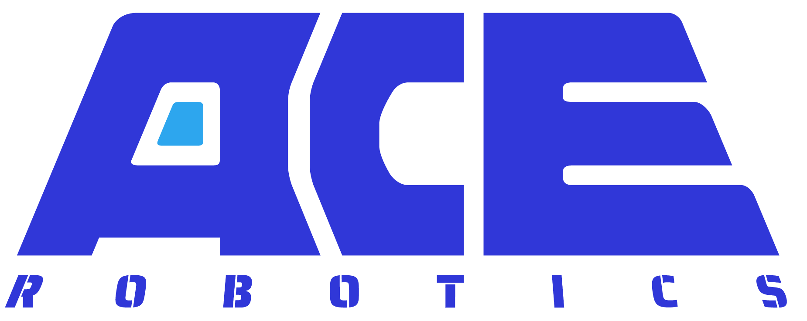
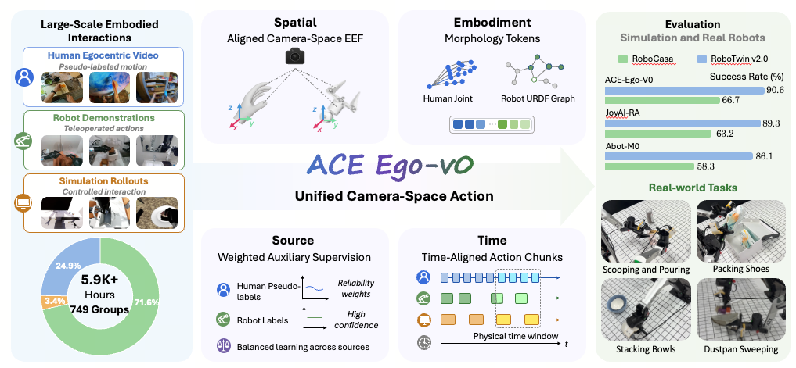
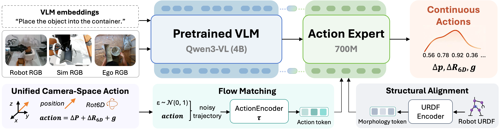

<p align="center">
  
  &nbsp;&nbsp;&nbsp;&nbsp;&nbsp;&nbsp;
  
</p>

<h1 align="center">ACE-Ego-0: Unifying Egocentric Human and Robotic Data for VLA Pretraining</h1>

<p align="center">
  <a href="https://acerobotics2025.github.io/ACE-Ego-0/"><strong>Project Page</strong></a> ·
  <a href="https://arxiv.org/pdf/2606.17200"><strong>Paper</strong></a> ·
  <a href="#-overview"><strong>Overview</strong></a> ·
  <a href="#-code"><strong>Code</strong></a> ·
  <a href="#-models"><strong>Models</strong></a> ·
  <a href="#-results"><strong>Results</strong></a> ·
  <a href="#-citation"><strong>Citation</strong></a>
</p>

## 🔥 News

- **2026-09**: GR1 RoboCasa 24 inference and evaluation code is released.
- **2026-06**: Project materials for *ACE-Ego-0: Unifying Egocentric Human and Robotic Data for VLA Pretraining* are available on the project page.

## 📖 Overview

<p align="center">
  
</p>

**ACE-Ego-0** is a unified vision-language-action (VLA) pretraining framework that combines egocentric human videos, multi-embodiment robot demonstrations, and simulation rollouts for robot policy learning.

## ✨ Highlights

- **Human + robot pretraining**: Uses 4.53K hours of robot/simulation data and 1.48K hours of pseudo-action-labeled egocentric human data.
- **Camera-space action alignment**: Represents human pseudo-actions and robot end-effector trajectories in the observation-centric camera frame.
- **Morphology conditioning**: Conditions the action expert with robot URDF graph embeddings and learned human surrogate tokens.
- **Strong transfer**: Achieves 72.8% average success on RoboCasa GR1 TableTop, 91.12% / 90.62% on RoboTwin 2.0 Easy / Hard, and 78.3% average success on real bimanual ARX tasks.

## 🧠 Method

<p align="center">
  
</p>

ACE-Ego-0 resolves four core mismatches between egocentric human video and robot trajectories:

1. **Spatial mismatch**: Human and robot motions are normalized through camera-space action representations.
2. **Embodiment mismatch**: Robot morphology and human surrogate embodiment information condition the action model.
3. **Temporal mismatch**: Action chunking aligns heterogeneous video and trajectory horizons.
4. **Label-quality mismatch**: Reliable robot actions supervise the primary objective, while noisier human pseudo-actions contribute through auxiliary losses.

## 📊 Results

| Benchmark | Metric | ACE-Ego-0 |
| --- | ---: | ---: |
| RoboCasa GR1 TableTop | Average success | **72.8%** |
| RoboTwin 2.0 Easy | Average success | **91.12%** |
| RoboTwin 2.0 Hard | Average success | **90.62%** |
| Real bimanual ARX tasks | Average success | **78.3%** |

## 💻 Code

This repository contains the ACE-Ego-0 codebase. Training code and additional benchmark support will be added progressively.

### Current release: GR1 RoboCasa 24

The currently available code provides inference and evaluation for the **GR1 RoboCasa 24** benchmark.

### Install

```bash
conda create -n ace-ego-robocasa24 python=3.10 -y
conda activate ace-ego-robocasa24

python -m pip install --upgrade pip setuptools wheel

# CUDA 12.4 PyTorch wheels.
python -m pip install \
  torch==2.6.0 torchvision==0.21.0 \
  --index-url https://download.pytorch.org/whl/cu124

python -m pip install "huggingface_hub>=0.34,<1"
python -m pip install -r requirements.txt
python -m pip install -e .
python -m pip install einops
```

Install Flash Attention 2.8.3 using the prebuilt wheel for Python 3.10, CUDA 12, and PyTorch 2.6:

```bash
python -m pip install \
  https://github.com/mjun0812/flash-attention-prebuild-wheels/releases/download/v0.7.16/flash_attn-2.8.3%2Bcu124torch2.6-cp310-cp310-linux_x86_64.whl
```

If this wheel is not compatible with the local driver or PyTorch installation, install the matching Flash Attention build for the local CUDA/PyTorch combination.

Verify the Python environment:

```bash
python -m pip check
python -c "import torch, flash_attn; print(torch.__version__, flash_attn.__version__)"
```

### Install RoboCasa

RoboSuite and the GR1 RoboCasa task package are installed separately because they are external dependencies. From the repository root, run:

```bash
bash scripts/install_robocasa.sh
```

To install only the Python packages and defer the large asset download:

```bash
SKIP_ROBOCASA_ASSETS=1 bash scripts/install_robocasa.sh
```

On a headless machine, set:

```bash
export MUJOCO_GL=egl
export MUJOCO_EGL_DEVICE_ID=0
```

Then verify the simulator setup:

```bash
python scripts/check_environment.py
```

Do not start inference if the checker reports missing assets or unregistered environments.

### Source layout

```text
src/ace_ego_0/             ACE-Ego-0 policy and model components
evaluation/robocasa24/     RoboCasa task runner, websocket server, and Mink IK
scripts/                   Environment setup, checks, smoke tests, and evaluation
assets/                    GR1 URDF/meshes, URDF cache, and Qwen lightweight files
checkpoints/robocasa24/    Configs and normalization statistics for the policies
```

## 🤗 Models

The currently released GR1 RoboCasa 24 checkpoints are hosted at:

```text
https://huggingface.co/acerobotics2025/ACE-Ego-0
```

Download both bundles:

```bash
HF_REPO_ID="acerobotics2025/ACE-Ego-0"

hf download "$HF_REPO_ID" \
  --repo-type model \
  --include "checkpoints/robocasa24/ace-ego-0-absolute/**" \
  --local-dir .

hf download "$HF_REPO_ID" \
  --repo-type model \
  --include "checkpoints/robocasa24/ace-ego-0-delta/**" \
  --local-dir .
```

Each checkpoint bundle contains:

- `config.yaml`
- `checkpoints/ace_ego_0_robocasa24_*.pt`
- `checkpoints/runtime_merged_dataset_statistics.json`

The `.pt` files contain the complete fine-tuned Qwen3-VL-4B-Instruct and ACE-Ego-0 state dictionaries. The matching config and normalization statistics must not be mixed between Absolute and Delta policies.

If you store a bundle elsewhere, pass the checkpoint path explicitly:

```bash
python scripts/smoke_test.py \
  --checkpoint /absolute/path/to/ace-ego-0-absolute \
  --urdf /absolute/path/to/GR1T2_with_hands.urdf \
  --task-index 2
```

Expected checkpoint hashes:

| Checkpoint | SHA256 |
| --- | --- |
| Absolute | `c438252368486737efa7fc6ac278d6be82d0ba07477d9dd8b73f479578f1e861` |
| Delta | `d32c73cb7dafa922a645d07803fb73c1dc9fed56048b7b7754989fd576d85d9b` |

## 🤖 GR1 URDF and Offline Cache

The repository includes `assets/GR1T2_with_hands.urdf` and the referenced mesh files for the released GR1 embodiment. You may use this URDF directly or provide a compatible local URDF with `--urdf`.

`assets/urdf_cache/GR1.pkl` is a path-free offline graph-tensor cache for the released GR1 embodiment. It avoids rebuilding the model-side URDF graph. Mink IK still reads the source URDF at runtime, so the `--urdf` path must exist even when the cache is present.

## 🎯 RoboCasa 24 Evaluation

Run one episode of task index 2 with the Absolute policy:

```bash
python scripts/smoke_test.py \
  --checkpoint checkpoints/robocasa24/ace-ego-0-absolute \
  --urdf assets/GR1T2_with_hands.urdf \
  --task-index 2
```

Run one task for 50 episodes with the Delta policy:

```bash
python scripts/evaluate.py \
  --checkpoint checkpoints/robocasa24/ace-ego-0-delta \
  --urdf assets/GR1T2_with_hands.urdf \
  --task-index 13 \
  --episodes 50
```

Run all 24 tasks for one episode each:

```bash
python scripts/evaluate.py \
  --checkpoint checkpoints/robocasa24/ace-ego-0-absolute \
  --urdf assets/GR1T2_with_hands.urdf \
  --task-start 0 \
  --task-end 23 \
  --episodes 1
```

Run the complete 24-task benchmark with 50 episodes per task:

```bash
python scripts/evaluate.py \
  --checkpoint checkpoints/robocasa24/ace-ego-0-delta \
  --urdf assets/GR1T2_with_hands.urdf \
  --task-start 0 \
  --task-end 23 \
  --episodes 50
```

The evaluator reads Absolute/Delta action semantics from the corresponding config. For Delta Action, it automatically uses the recorded reconstruction settings.

Each run writes per-task logs, videos, and `summary.json` under `outputs/`. These are local evaluation artifacts and are ignored by Git.

### Explicit local server mode

Start the policy server in one terminal:

```bash
python scripts/run_server.py \
  --checkpoint checkpoints/robocasa24/ace-ego-0-delta \
  --urdf /absolute/path/to/GR1T2_with_hands.urdf \
  --host 127.0.0.1 \
  --port 5678
```

Connect the evaluator from a second terminal:

```bash
python scripts/evaluate.py \
  --checkpoint checkpoints/robocasa24/ace-ego-0-delta \
  --urdf /absolute/path/to/GR1T2_with_hands.urdf \
  --connect-only \
  --host 127.0.0.1 \
  --port 5678 \
  --task-start 0 \
  --task-end 23 \
  --episodes 1
```

Use `--dry-run` to inspect generated server and simulator commands without starting CUDA inference or MuJoCo.

## 📝 Citation

If you find ACE-Ego-0 useful, please cite:

```bibtex
@misc{li2026aceego0unifyingegocentrichuman,
  title         = {ACE-Ego-0: Unifying Egocentric Human and Robotic Data for VLA Pretraining},
  author        = {Hao Li and Ganlong Zhao and Yufei Liu and Haotian Hou and Guoquan Ye and Tongyan Fang and Chunxiao Liu and Siyuan Huang and Jianbo Liu and Xiaogang Wang and Hongsheng Li},
  year          = {2026},
  eprint        = {2606.17200},
  archivePrefix = {arXiv},
  primaryClass  = {cs.RO},
  url           = {https://arxiv.org/abs/2606.17200}
}
```

## 📬 Contact

For questions about the ACE-Ego-0 release, please open an issue in this repository.

## License

The released inference code is MIT licensed. RoboCasa, RoboSuite, Qwen3-VL, Mink, MuJoCo, and other dependencies retain their own licenses.
