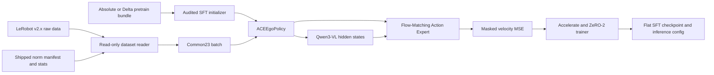

# ACE-Ego-0 SFT 训练设计与实现说明

本文总结当前仓库中 RoboCasa 24 与 ARX SFT 的设计边界、代码结构、关键数值合同、
使用方法、验证结果和维护注意事项。实施计划见
[`open_source_sft_training.md`](open_source_sft_training.md)。落地后的数据布局、
本地辅助脚本和集群验收见
[`sft_training_status.md`](sft_training_status.md)。

## 1. 发布范围

当前公开训练支持：

- RoboCasa GR1 TableTop 24：
  - Absolute Action SFT
  - Delta Action SFT
- ARX 当前正式验收任务：
  - `stack_ceramic_bowls` Absolute / Delta
- `configs/arx/` 仍保留 `heat_sandwich`、`pour_coffee_beans`、
  `scan_pencil_case_new` 的 recipe，但不再作为当前正式训练范围
- 两个 Common23 SFT 初始化模型：
  - `ace-ego-0-pretrain-absolute`，对应内部 0428 200k
  - `ace-ego-0-pretrain-delta`，对应内部 0427 200k

明确不包含：

- RoboCasa365 或 Mobile Native34。
- Common23 449-mixture pretrain 训练代码。
- norm 计算、runtime stats merge 或 stats cache 写入。
- dynamic chunking、temporal memory、human auxiliary loss。
- Ceph、ACP、内部集群 launcher。
- optimizer state resume。
- ARX 真机 serving 和 RoboTwin evaluation。

论文报告了 6 个 ARX 任务；内部 0912 仓有 4 个可复现 recipe。当前公开正式训练
只验收 `stack_ceramic_bowls`。本仓库不推测论文中另外两个任务的数据或训练合同。

## 2. 整体架构



设计原则：

1. 复用当前 eval 模型和 state-dict key，不创建第二套训练模型。
2. 数据层只支持 GR1/ARX 的已发布 schema，不迁入整个原始 dataloader。
3. 所有 normalization statistics 均由数据包提供，训练代码永不计算。
4. 未被正式 recipe 使用的功能不进入公开实现。
5. 通过固定样本数值对齐证明正确性，而不只验证代码能够启动。

## 3. 代码结构

### 模型

- [`src/ace_ego_0/model/framework/ace_ego_policy.py`](../src/ace_ego_0/model/framework/ace_ego_policy.py)
  - 训练和推理共用的 policy。
  - `forward()` 负责批数据准备、VLM 编码和 repeated diffusion。
  - `predict_action()` 保持原有 RoboCasa eval 接口。
- [`src/ace_ego_0/model/modules/action_model/flow_matching_action_expert.py`](../src/ace_ego_0/model/modules/action_model/flow_matching_action_expert.py)
  - Flow-matching 训练 loss 和推理 ODE sampling。
  - State timestep conditioning、URDF conditioning 和 DiT 参数均与已有 checkpoint 对齐。
- [`src/ace_ego_0/model/modules/vlm/qwen3_vl.py`](../src/ace_ego_0/model/modules/vlm/qwen3_vl.py)
  - Qwen3-VL BF16 前向。
  - 固定 processor pixel budget。
  - 支持 gradient checkpointing。

### 数据

- [`src/ace_ego_0/data/common23.py`](../src/ace_ego_0/data/common23.py)
  - q99 normalization。
  - RoboCasa raw33 统计布局到 Common23 的变换。
  - ARX raw20 到 Common23 的变换。
  - Fourier 6D hand 到 1D gripper。
- [`src/ace_ego_0/data/lerobot.py`](../src/ace_ego_0/data/lerobot.py)
  - LeRobot v2.0/v2.1 parquet 和视频读取。
  - manifest、metadata、stats 合同校验。
  - 固定相机顺序：`ordered_video_keys()` /
    `ordered_video_entries()`。
  - episode/frame 定位、action horizon 和末帧 padding。
  - identity collator。

### 训练

- [`src/ace_ego_0/training/config.py`](../src/ace_ego_0/training/config.py)
  - 小型 `base_config` 递归合并。
- [`src/ace_ego_0/training/checkpointing.py`](../src/ace_ego_0/training/checkpointing.py)
  - abs/delta 初始化检查。
  - pretrain 到 SFT 的精确 key allowlist。
- [`src/ace_ego_0/training/trainer.py`](../src/ace_ego_0/training/trainer.py)
  - Accelerate + DeepSpeed ZeRO-2。
  - 参数分组、AdamW、scheduler、gradient clipping。
  - JSONL/W&B logging 和 flat checkpoint 导出。
- [`scripts/train.py`](../scripts/train.py)
  - 统一训练 CLI。
  - 可覆盖 data / norm / checkpoint / output / run_id / max-steps /
    batch size / workers。

### 配置

- [`configs/common_sft.yaml`](../configs/common_sft.yaml)：共享模型和 trainer 合同。
- [`configs/robocasa24/`](../configs/robocasa24/)：2 个 RoboCasa recipe 和 24-task manifest。
- [`configs/arx/`](../configs/arx/)：2 个基础配置、task recipe 和 manifest。
  当前正式训练只用 `stack_ceramic_bowls`。
- [`configs/accelerate/zero2.yaml`](../configs/accelerate/zero2.yaml)：Accelerate 启动配置。
- [`configs/accelerate/zero2.json`](../configs/accelerate/zero2.json)：DeepSpeed ZeRO-2 配置。

## 4. 模型与 loss 合同

公共配置固定：

```text
action_dim                 23
state_dim                  23
action_horizon             30
future_action_window_size  29
past_action_window_size     0
state_injection_mode       timestep_conditioning
repeated_diffusion_steps    4
VLM dtype                  bfloat16
action expert dtype        float32
```

Flow-matching 训练只支持正式 recipe 使用的 velocity parameterization：

1. 采样 `u ~ Beta(1.5, 1.0)`。
2. 计算 `t = (0.999 - u) / 0.999`。
3. 生成与 action 同形状的 Gaussian noise。
4. 同时 mask clean action 和 noise 的无效维。
5. 构造 `x_t = (1 - t) * noise + t * action`。
6. target velocity 为 `action - noise`。
7. DiT 预测 velocity。
8. `total_loss` 为所有有效时空维度上的 MSE。

Common23 loss groups 只用于输出 left/right xyz、rot6d、gripper、waist 的诊断指标，
不改变 `total_loss` 权重。ARX 的 3 个 waist action 维为零且 mask=False，不参与 loss。

公开实现会拒绝以下未支持配置：

- 非 velocity loss parameterization。
- geodesic rot6d loss。
- action-mask conditioning token。
- dynamic action chunking。
- runtime URDF cache build。

## 5. Common23 数据合同

Common23 维度布局：

```text
[0:3]    left EEF xyz in camera frame
[3:9]    left EEF rot6d in camera frame
[9:12]   right EEF xyz in camera frame
[12:18]  right EEF rot6d in camera frame
[18]     left gripper
[19]     right gripper
[20:23]  waist
```

变换顺序必须保持：

```text
raw keys
  -> optional per-key delta
  -> q99 normalization
  -> Common23 concatenation and mask
```

不能先拼 Common23 再做 delta。Delta recipe 使用：

```text
delta_action_mode  state_anchor
delta_base_state   first_state
delta_quat_mode    subtract
```

xyz、rot6d 和 waist 相对当前 state 做 subtract；gripper 保持绝对值。

### RoboCasa 24

- 磁盘格式：当前数据为 LeRobot v2.0 OldStyleEEF。
- 图像：`observation.images.ego_view`，训练输入 224×224。
- 语言：episode `remarks`，并去掉可选的 `locked_waist:` /
  `unlocked_waist:` 前缀。
- EEF 来自 camera-frame 列：`state/action.{left,right}_eef_{pos,rot6d}_cam`。
- 原始 hand / waist 从 packed 向量切片，不从独立列读取：
  - `left_hand`：`[7:13]`
  - `right_hand`：`[29:35]`
  - `waist`：`[41:44]`
- 原始 hand：每只手 6D。
- Gripper：取前四个 finger joint，`(clip(x + 1.5) / 3)` 得到 `[0, 1]` 后取平均，
  再执行 `* 2 - 1` 映射到 `[-1, 1]`。hand 维不做 q99。
- Delta 只对 EEF xyz / rot6d 和 waist 做 subtract，跳过两只 hand。
- Robot type：`fourier_gr1_eef_gripper_6d`。
- Model robot name：`GR1`。
- Common23 action/state mask 全部有效。
- 24 个数据目录必须使用
  [`configs/robocasa24/datasets.yaml`](../configs/robocasa24/datasets.yaml)
  中的完整名字，不能按短 task 名猜测。

### ARX

- 磁盘格式：LeRobot v2.1。
- 图像顺序由 `ordered_video_keys()` 固定，不跟随 `modality.json` 的 dict
  遍历顺序：
  1. `observation.images.cam_high`
  2. `observation.images.cam_left_wrist`
  3. `observation.images.cam_right_wrist`
- 训练输入：每路 256×256。
- 语言：parquet `prompt`，语义对应
  `annotation.human.action.task_description`。
- Raw20：
  - left EEF 9D
  - left gripper 1D
  - right EEF 9D
  - right gripper 1D
- Delta 只对左右 EEF 9D 做 subtract，跳过 gripper；waist 在 concat 之后才补零。
- Disk robot type：`arx_dual_arm`。
- Training robot type：`arx_dual_arm_common23`。
- Model robot name：`ARX5Dual`。
- Common23 waist 补零；action mask=False，state mask 保持生产实现的全 True。
- `stack_ceramic_bowls` 必须包含 manifest 中全部 7 个 session。

## 6. Norm manifest

每个 recipe 只接受一个不可变 norm manifest。最小结构：

```json
{
  "schema_version": 1,
  "action_mode": "absolute",
  "robot_type": "arx_dual_arm_common23",
  "norm_key": "arx",
  "artifacts": {
    "merged_stats_path": "merged_stats.json"
  }
}
```

RoboCasa 使用 `norm_key: "gr1"` 和 33D raw stats；ARX 使用
`norm_key: "arx"` 和 20D raw stats。merged stats 必须同时包含 action/state 的
`q01` 与 `q99`。

每个数据目录还必须包含：

```text
meta/info.json
meta/modality.json
meta/episodes.jsonl
```

实际 normalization 使用 manifest 指向的 merged stats。本地 overlay 和公开数据包
不包含 `experiments/`、`meta/metadata.json`、`meta/stats.json`、
`meta/steps_data_index.pkl`、`meta/tasks.jsonl` 或 per-dataset `stats_gr00t*.json`。

注意：

- `pour_coffee_beans` 和 `scan_pencil_case_new` 的 recipe 必须自带 `norm/` 下的
  shipped merged stats。
- `stack_ceramic_bowls` 的 merged stats 必须提前按 `parent_task` 口径生成。
- 缺文件、key、维度、非有限值、`q99 < q01` 或 abs/delta 不匹配都会立即失败。
- loader 不包含任何 compute-stats fallback。

## 7. URDF morphology cache

### GR1

模型必须使用训练时的 34 节点 cache：

```text
assets/urdf_cache/GR1.pkl
SHA256 dea552de1d4449e8c5db5cf7215b80a171c155b5c430dda00e44402e361acc1d
```

`assets/GR1T2_with_hands.urdf` 是 58 关节的仿真、render 和 Mink IK 资产。用它重建
`GR1.pkl` 会把模型输入改成 58 节点图，不能用于复现训练或论文结果。

canonical cache 内记录的内部 URDF build path 只作为 provenance。cache-only 模式会忽略
该路径与公开 URDF 路径的差异。RoboCasa eval 和所有 SFT config 都必须保持：

```yaml
urdf_auto_build_cache: false
```

### ARX

```text
assets/urdf_cache/ARX5Dual.pkl
SHA256 7ebd6dad97105fa17a049dbec75912f3c32d24193ccd84562a78620e6dbd3fa6
```

ARX 公开训练同样为 cache-only，不需要发布或解析 ARX source URDF。

## 8. Pretrain 与 SFT checkpoint

Pretrain bundle：

```text
checkpoints/pretrain/
├── ace-ego-0-pretrain-absolute/
│   ├── config.yaml
│   ├── SHA256SUMS
│   └── checkpoints/ace_ego_0_pretrain_absolute.pt
└── ace-ego-0-pretrain-delta/
    ├── config.yaml
    ├── SHA256SUMS
    └── checkpoints/ace_ego_0_pretrain_delta.pt
```

哈希：

```text
Absolute  02ee20977add7c41ce3a8f3b1164ef2928d88e02884ebd29d550d0c234448d3c
Delta     f1ae71ce55f4bf609f70af83797081789f41e90f47dc041bae10bae0c3bd06b0
```

完整 pretrain state dict 有 1290 个 key，其中包含 10 个
`action_model.learnable_urdf_embeddings.human_video*` 参数。pretrain config 声明这些
参数，因此完整 bundle 可以 strict load。

目标 SFT 模型不需要 human surrogate token。SFT initializer 要求：

- `missing_keys=[]`。
- `unexpected_keys` 必须精确等于已审计的 10 个
  `action_model.learnable_urdf_embeddings.human_video*` key。
- 共享 key 的 shape 必须全部一致。
- 其他任何差异立即失败。

这 10 个 key 写死在
[`src/ace_ego_0/training/checkpointing.py`](../src/ace_ego_0/training/checkpointing.py)
的 `EXPECTED_PRETRAIN_HUMAN_SURROGATE_KEYS` 中，不能用普通 `strict=False` 放宽。

最终 RoboCasa/ARX SFT state dict 为 1280-key 拓扑，与现有 RoboCasa eval 模型一致。

Absolute/Delta 禁止交叉初始化。检查依据是 checkpoint bundle 的 `config.yaml`，不是文件名。

不要跨 bundle 使用符号链接指向另一目录的 `.pt`。当前 checkpoint resolver 会解析真实
路径，并从真实路径上两级目录读取 config；跨目录 symlink 可能导致读取错误的
`config.yaml`。发布和正式验证应使用 bundle 内的普通文件。

## 9. Trainer

训练参数：

- 全参数训练，不使用 LoRA。
- Accelerate `mixed_precision=no`。
- DeepSpeed ZeRO-2。
- Qwen 模块内部 BF16。
- Action expert FP32。
- Gradient checkpointing 同时作用于 Qwen 和 action DiT。
- AdamW：
  - betas `[0.9, 0.95]`
  - eps `1e-8`
  - weight decay `1e-8`
  - `foreach=false`
- Gradient clipping：1.0。
- Warmup：5000 steps。
- Scheduler：cosine with minimum LR `5e-7`。

学习率和预算：

- RoboCasa 24：
  - per-device batch size 16
  - 200k steps
  - base LR `1e-5`
  - Qwen LR `2e-5`
  - action expert LR `1e-4`
- ARX：
  - per-device batch size 16
  - 100k steps
  - base/Qwen LR `1e-5`
  - action expert LR `1e-4`

checkpoint 输出：

```text
<run_root>/<run_id>/
├── training_config.yaml
├── config.yaml
└── checkpoints/
    ├── steps_<N>_pytorch_model.pt
    ├── runtime_merged_dataset_statistics.json
    └── training_metrics.jsonl
```

`training_config.yaml` 保存完整 recipe；`config.yaml` 是可供
`ACEEgoPolicy.from_pretrained()` 使用的精简 inference config。训练 recipe 不再携带
eval 专用字段；导出时 trainer 会写回 `include_state`、`rot/trans/gripper_norm_mode=q99`，
RoboCasa 还会写回 `language_source=episode_remarks`。已发布的 RoboCasa eval bundle
`config.yaml` 保持不动。

Trainer 不保存 optimizer state，也不支持 resume。W&B 只有在 `trackers` 显式包含
`wandb` 且安装 `.[wandb]` 时启用；默认只写 JSONL。

## 10. 使用方法

安装：

```bash
python -m pip install -r requirements.txt
python -m pip install -e ".[train]"
```

如果当前 Python 环境里还有另一份 `ace_ego_0`，训练启动必须把本仓库放在最前：

```bash
export PYTHONPATH=/path/to/ACE-Ego-0/src:/path/to/ACE-Ego-0
```

检查配置：

```bash
python scripts/train.py \
  --config configs/robocasa24/absolute_sft.yaml \
  --dry-run
```

RoboCasa 24：

```bash
accelerate launch \
  --config_file configs/accelerate/zero2.yaml \
  --mixed_precision no \
  scripts/train.py \
  --config configs/robocasa24/absolute_sft.yaml
```

ARX 正式任务：

```bash
accelerate launch \
  --config_file configs/accelerate/zero2.yaml \
  --mixed_precision no \
  scripts/train.py \
  --config configs/arx/stack_ceramic_bowls_delta_sft.yaml
```

常用覆盖：

```bash
python scripts/train.py \
  --config configs/arx/stack_ceramic_bowls_absolute_sft.yaml \
  --data-root /path/to/arx \
  --norm-manifest /path/to/norm_manifest.json \
  --pretrained-checkpoint /path/to/ace_ego_0_pretrain_absolute.pt \
  --output-dir /path/to/runs \
  --run-id bowls_abs_sft
```

`--max-steps` 会同时把 `save_interval` 压到不超过该步数，便于 smoke / 短测写出
`steps_<N>_pytorch_model.pt`。例如：

```text
--max-steps 2
--per-device-batch-size 1
--num-workers 0
```

这些参数只改变运行规模，不改变模型、数据和 norm 合同。集群数据布局、SKU 和验收
作业见 [`sft_training_status.md`](sft_training_status.md)。

## 11. 已完成验证

### 自动测试

- 公开仓库当前不附带 `tests/`。这些单测只做合同检查，训练入口不会调用它们。
- Ruff：
  - 全部检查通过。
  - 73 个 Python 文件格式通过。
- Wheel：
  - `ace_ego_0-0.2.0-py3-none-any.whl` 构建成功。

### 模型数值

- 精简 flow-matching action expert 与原训练仓参考实现：
  - sampled noise 完全一致。
  - timestep 完全一致。
  - noisy trajectory 完全一致。
  - target/pred velocity 完全一致。
  - total loss 完全一致。

### Loader 数值

固定 episode 0 / frame 0 与原训练仓比较：

```text
RoboCasa absolute  action max error 2.38e-7, state max error 9.54e-7
RoboCasa delta     action max error 1.49e-7, state max error 9.54e-7
ARX absolute       action max error 2.98e-7, state max error 3.70e-6
ARX delta          action max error 4.77e-7, state max error 3.70e-6
```

四条路径的 image、language、mask、robot identity 均对齐；ARX state mask 在修正后也与
生产实现一致。

### Checkpoint

- RoboCasa Absolute / Delta：
  - 均 strict load 1280 个 key。
  - 均确认模型读取 34 节点 GR1 cache。
- Pretrain：
  - 1290 个 key。
  - Absolute 完整 bundle strict load 通过。
  - Absolute/Delta 与 SFT 拓扑均为 1280 个共享 key + 10 个审计 human key。
- 两个 pretrain `.pt` 的 SHA256 与原始 0428/0427 文件一致。

### RoboCasa eval

使用当前仓库、本地普通 checkpoint 文件和 canonical 34-node cache，对 task index 2
分别执行 1 episode：

```text
Absolute  SUCCESS, 9 steps, IK failures 0
Delta     SUCCESS, 9 steps, IK failures 0
```

评测结束后 `GR1.pkl` SHA256 保持 `dea552de…`，确认没有从 with-hands URDF 重建。

### Trainer

使用 tiny policy 完成 2-step trainer 测试，覆盖：

- forward/backward。
- optimizer/scheduler。
- gradient clipping。
- JSONL。
- flat checkpoint。
- training/inference config 分离。
- target stats 复制。

单测覆盖 tiny policy 的 2-step trainer。完整 4B 模型已在 A800 训练池完成：

- 2 卡 2-step smoke：RoboCasa abs/delta 与 bowls abs/delta。
- 8 卡 100-step：同上四个 recipe，loss 有限并写出 `steps_100_pytorch_model.pt`。

完整 RoboCasa 200k 与 bowls 100k 尚未提交。作业号、loss 曲线和本地 launcher 见
[`sft_training_status.md`](sft_training_status.md)。训练不要打到 4090 评测池。

## 12. 发布与维护注意事项

1. 不要将 `urdf_auto_build_cache` 改回 true。
2. 不要从 `GR1T2_with_hands.urdf` 重建 morphology cache。
3. 不要把 pretrain stats 用于目标 SFT 或 serving。
4. 不要放宽 pretrain initializer 的 human-key allowlist。
5. 不要通过普通 `strict=False` 隐藏 checkpoint 结构错误。
6. 不要把 RoboCasa365 action/state schema 加入当前 Common23 loader。
7. 不要删除 ARX waist mask；padding 必须为零且不参与 action loss。
8. 不要交换多视角顺序。ARX 必须走 `ordered_video_keys()`，不能按
    `modality.json` 的 dict 遍历顺序读取。
9. 不要把 Delta 处理移动到 Common23 concat 或 normalization 之后。
10. 不要在公开数据发布前遗漏 pour/scan stats 或 bowls parent-task merged stats。
11. 模型大文件保持 Git ignored，通过 Hugging Face 发布；config、SHA manifest 和 README
    进入 Git。
12. 数据、Qwen3-VL、RoboCasa/RoboSuite、机器人资产和第三方代码继续遵守各自许可证；
    详见 [`THIRD_PARTY_NOTICES.md`](../THIRD_PARTY_NOTICES.md)。

## 13. 当前仓库里仍多余的代码

公开 SFT 已经落地后，从内部仓带过来的无用代码已在 2026-09-14 按「应删」清单清掉。
训练侧未读 YAML、二次 resize、dummy `stats_gr00t*` 检查和重复 hand→gripper 已在
2026-09-15 收掉。未动 extra ARX recipe 和 URDF parser。

已删除或收窄：

- 空目录 `src/ace_ego_0/model/modules/render_state/`。
- 空文件 `src/__init__.py`。
- 误创建的
  `checkpoints/robocasa24/ace-ego-0-absolute ace_ego_0_robocasa24_absolute.pt ` 目录。
- [`src/ace_ego_0/utils/rotation_utils.py`](../src/ace_ego_0/utils/rotation_utils.py)
  只保留 Common23 23D 的 `identify_*`、`rot6d_to_matrix` / `matrix_to_rot6d`、
  以及 eval 需要的 quaternion delta 辅助函数。已去掉 80D UAS import、
  34D/19D/16D/14D 分支，以及未被调用的 geodesic / dual-arm / pytorch3d 包装。
- [`src/ace_ego_0/inference_utils/image_tools.py`](../src/ace_ego_0/inference_utils/image_tools.py)
  只保留 `to_pil_preserve`。
- 训练 recipe 去掉 `language_source`、`include_state`、`epoch_sampling_mode`、
  `normalization_strategy`、`model_*_key`、`*_norm_mode`、`delete_pause_frame`。
- `ACEEgoPolicy.forward` 不再二次 resize；`predict_action` 仍按 `image_size` resize。
- loader 不再检查 per-dataset `stats_gr00t*.json`。
- Fourier hand↔gripper 只保留在
  [`src/ace_ego_0/data/common23.py`](../src/ace_ego_0/data/common23.py)；
  eval 的 `hand_to_gripper.py` 只做 re-export。

### 仍先留着

- `configs/arx/` 里 `heat_sandwich` / `pour_coffee_beans` / `scan_pencil_case_new` 的 6 份 recipe。
  正式验收只剩 `stack_ceramic_bowls`，但 recipe 和部分测试还在用 `heat_sandwich` 当代表配置。删之前要先改测试。
- URDF parser / graph builder 在 cache-only 训练路径上不会跑，但 eval 的 `urdf_auto_build_cache` 和 cache 重建仍依赖它们，不能删。
- `framework_override`、`ACE_Ego_0` alias、`GR1_ROBOCASA24_BASE_VLM` 是很小的兼容入口，可留。

### 运行时垃圾（本来就不进 Git）

- `assets/.gr1_ik_tmp/`：Mink IK 临时 URDF，已被 gitignore。
